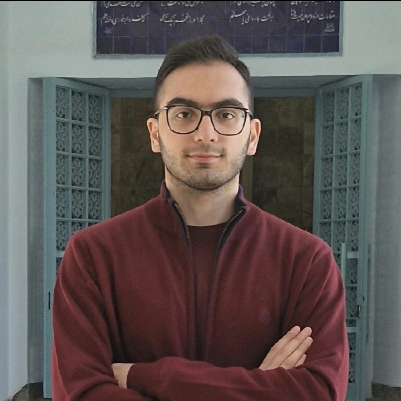

Welcome to Café CS — a cozy gathering for curious minds who love computer science, problem-solving, and good conversation. Each week, we bring together students, developers, mathematicians, and enthusiasts to explore ideas across CS: from algorithms and theory to AI, software engineering, hardware, and everything in between.

Our goal is simple: create a warm, welcoming space where people can learn from one another, think together, and enjoy the process of understanding complex ideas — all without the pressure of a classroom or the formality of a conference. Just thoughtful minds, good vibes, and interesting discussions. 

 **This is our team:**

  <a href="https://github.com/Sadra3st" class="member">
  
  
Sadra Seyedtabaei

</a>
<a href="https://github.com/srgtSajjad" class="member">
  
  
Mohammad Sajjad Zanganeh

</a>
<a href="https://github.com/AminGh05" class="member">
  
  
Amin Ghoorchian

</a>
<a href="https://github.com/ShayanShahrabi" class="member">
  
  
Shayan Shahrabi

</a>
<a href="https://github.com/alithz" class="member">
  
  
Ali Taherzadeh

</a>
<a href="https://github.com/mehrdadShirvani" class="member">
  
  
Mehrdad Shirvani

</a>
<a href="https://github.com/Al1Nad1" class="member">
  
  
Ali Nadi

</a>
<a href="https://github.com/HiradTorabi" class="member">
  
  
Hirad Torabi

</a>

