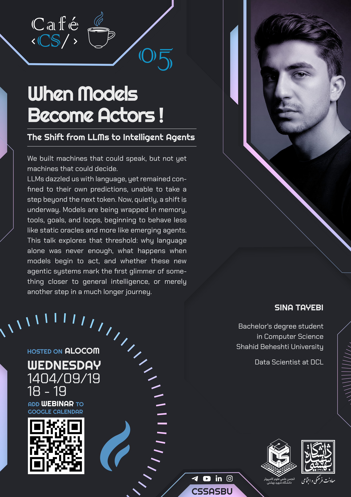
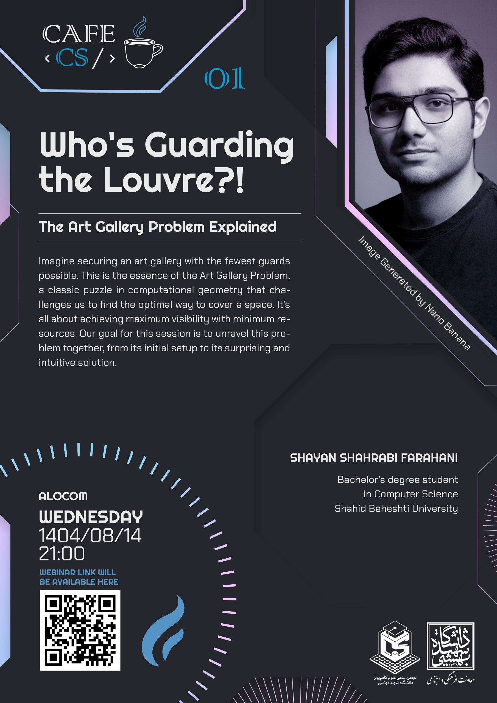

# ☕ Café CS

## 🎙 Upcoming & Past Talks

  <table>
    <thead>
      <tr>
        <th>Poster</th>
        <th>Talk Info</th>
      </tr>
    </thead>
    <tbody>
    <tr>
	    <td>
          
        </td>
        <td>
          

            <a href="talks/1404-09-19-When-Models-Become-Actors/notes.md" >#005: When Models Become Actors !</a>
             | The Shift from LLMs to Intelligent Agents
          

          <a href="https://github.com/sinaapolo969">
	          Sina Tayebi
          </a>
          

            Dec 10, 2025
            ai
			llms
			agents
			agentic-systems
			memory
			tool-use
			autonomous-agents
			agi
			emergent-behavior
			ai-philosophy
			future-of-ai
          

          

            We built machines that could speak, but not yet machines that could decide. LLMs dazzled us with language, yet remained confined to their own predictions, unable to take a step beyond the next token. Now, quietly, a shift is underway. Models are being wrapped in memory, tools, goals, and loops, beginning to behave less like static oracles and more like emerging agents. This talk explores that threshold: why language alone was never enough, what happens when models begin to act, and whether these new agentic systems mark the first glimmer of something closer to general intelligence, or merely another step in a much longer journey.
          

          

            Resources:  
            <a href="talks/1404-09-19-When-Models-Become-Actors/slides.pdf">Slides</a>
          

        </td>
      </tr>
    <tr>
	    <td>
          
        </td>
        <td>
          

            <a href="talks/1404-09-05-The-Evolution-of-Data-Architecture/notes.md" >#004: The Evolution of Data Architecture!</a>
             | From Warehouses to Lakehouses and the Rise of Real-Time Processing
          

          <a href="https://github.com/Navid-Ebadi-2003">
	          Navid Ebadi
          </a>
          

            Nov 26, 2025
            big-data
            data-warehousing
            data-lakes
            data-lakehouses
            real-time-stream-processing
            data-storage
            data-processing
            data-management
            data-evolution
          

          

            We live in an era where data is generated at unprecedented speed, volume, and variety—a phenomenon widely known as Big Data . This explosion of information has fundamentally changed how organizations store, process, and analyze their digital assets.
            In this lecture we'll explore the evolution from traditional Data Warehouses (structured storage for analytics) to flexible Data Lakes (raw data repositories), and innovative Data Lakehouses (combining the best of both). Finally, we'll discuss real-time stream processing.
          

          

            Resources:  
            <a href="talks/1404-09-05-The-Evolution-of-Data-Architecture/slides1.pdf">Slides 1</a>
            <a href="talks/1404-09-05-The-Evolution-of-Data-Architecture/slides2.pdf">Slides 2</a>
            <a href="https://www.youtube.com/watch?v=D5sedVmHbqk">Video</a>
          

        </td>
      </tr>
      <tr>
	    <td>
          
        </td>
        <td>
          

            <a href="talks/1404-08-28-Fun-Meets-Function/notes.md" >#003: Fun Meets Function</a>
             | When Games Get Serious !
          

          <a href="https://github.com/MehrdadShirvani">
	          Mehrdad Shirvani
          </a>
          

            Nov 19, 2025
            games
            serious-games
            gamification
            learning
            creativity
            innovation
            problem-solving
            motivation
            human-intuition
            behavioral-science
          

          

            Games are shaping the way we learn, solve problems, and innovate. They tackle real-world challenges, from scientific discovery to improving health behaviors. In this session, we’ll explore how play can become a tool for learning, creativity, and positive change. By harnessing human intuition and motivation, we’ll see how the mechanics that make games engaging can also turn them into powerful engines for real-world impact.
          

          

            Resources:  
            <a href="talks/1404-08-28-Fun-Meets-Function/slides.pdf">Slides</a>
            <a href="https://www.youtube.com/watch?v=ngArnhT1szM">Video</a>
          

        </td>
      </tr>
      <tr>
        <td>
          
        </td>
        <td>
          

            <a href="talks/1404-08-21-Beyond-The-Bank/notes.md">#002: Beyond the Bank</a>
             |  What is Bitcoin & Why?!
          

          <a href="https://github.com/seyed0123">
	          Seyed Ali Hosseini Nasab
          </a>
          

            Nov 12, 2025
            bitcoin
            blockchain
            decentralized-systems
            cryptography
            digital-money
            peer-to-peer
            finance
            technology
          

          

            From obscurity to global headlines, Bitcoin has sparked a financial revolution that challenges our deepest assumptions about money. But what truly lies beneath the digital surface? This presentation goes beyond the price tag to uncover the core innovation: a decentralized system that allows us to trust each other without needing to trust a middleman. We will unravel how Bitcoin creates digital scarcity and enables peer-to-peer value transfer across the globe, exploring its emergence as "digital gold" and its potential to redefine the future of finance.
          

          

            Resources:  
            <a href="talks/1404-08-21-Beyond-The-Bank//slides.pdf">Slides</a>
            <a href="https://youtu.be/p1QJ-IL952U?si=5ce-O2Mb8VnvISQ1">Video</a>
          

        </td>
      </tr>
      <tr>
        <td>
          
        </td>
        <td>
          

            <a href="talks/1404-08-14-Who-Is-Guarding-the-Louvre/notes.md">001: Who is Guarding the Louvre?!</a>
            | The Art Gallery Problem Explained
          

          <a href="https://github.com/ShayanShahrabi">
	          Shayan Shahrabi Farahani
          </a>
          

	        Nov 5, 2025
            computational-geometry
            optimization
            visibility
            algorithms
            geometry
            problem-solving
            theory
            math
          

          

            Imagine securing an art gallery with the fewest guards possible. This is the essence of the Art Gallery Problem, a classic puzzle in computational geometry that challenges us to find the optimal way to cover a space. It's all about achieving maximum visibility with minimum resources. Our goal for this session is to unravel this problem together, from its initial setup to its surprising and intuitive solution.
          

          

            Resources:
            <a href="talks/1404-08-14-Who-Is-Guarding-the-Louvre/slides.pdf">Slides</a>
            <a href="https://www.youtube.com/watch?v=hRg6qiIglMA&list=PLuHvv8pyNyW96X5cs0kZTM5AB1SQaytZg&index=4">Video</a>
          

        </td>
      </tr>
    </tbody>
  </table>

---

## About Café CS

Many events inspired us to ignite the engines of Café CS - from the legendary series of Combinatorics Circle Seminars organized by the minds behind Iran’s Combinatorics Olympiad, to the Tabaghe16 Podcast of Soheil Alavi, which - by his own words - brews a magnetism that gathers people who think alike… and see the world through the same lens.

We even took a sip from past experiences - like the Math Circle Book - a place where people gathered around a shared table and solved problems together… much like a group of heroes plotting strategy over steaming mugs of logic.

All these sparks combined - and forged the idea that we, too, should ignite our own gathering - a place where computer scientists, tech lovers, mathematicians, and curious spirits unite. A corner café where we talk about the very foundation beans of CS - from machine learning and artificial intelligence to software & hardware engineering, mathematics, graph theory, and anything roasted, brewed, or filtered through the world of computer science.

Here, once a week, we gather - tea in hand, curiosity online, engines engaged - to discuss what we love.

These sessions aren’t meant to be a class - nor a conference. No towering lecture halls. No rigid protocols. Just a warm, friendly café chat for inquisitive minds - to learn from one another, spark ideas, and build a cozy fellowship of computer enthusiasts.

Till we meet again, fellow travelers of logic… 🙌❤️☕

> [!tip] [Café CS](AboutUs) - More Than a Gathering. A Brewed Alliance.
